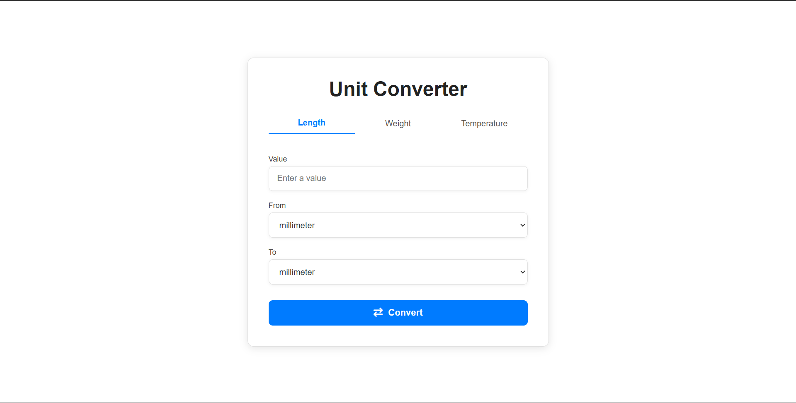

# Unit Converter



**Unit Converter** is a simple web application that allows users to convert units such as **length**, **weight**, and **temperature**. The app is built using [Go Fiber](https://gofiber.io/) as the web framework and [Mustache](https://mustache.github.io/) as the template engine. The sample solution for the [unit-converter](https://roadmap.sh/projects/unit-converter) challenge from [roadmap.sh](https://roadmap.sh/).


## Features

- **Length Conversion**: Millimeter, centimeter, meter, kilometer, inch, foot, yard, mile.
- **Weight Conversion**: Milligram, gram, kilogram, ounce, pound.
- **Temperature Conversion**: Celsius, Fahrenheit, Kelvin.
- Simple and responsive user interface.
- Retains results within their respective tabs without reloading the page.

## Technologies Used

- **Programming Language**: Go
- **Web Framework**: Fiber
- **Template Engine**: Mustache
- **UI Interaction & Styling**: JS, CSS

## Installation

Clone this repository to your local directory:
```bash
git clone https://github.com/fhasnur/unit-converter.git
cd unit-converter
```

Install all required dependencies:
```bash
go mod tidy
```

Run the application:
```bash
go run main.go
```

Open the application in your browser at:
```bash
http://localhost:3000
```

## Project Structure

```bash
unit-converter/                 
├── assets/
│   └── unit-converter.png    # Screenshot of the Unit Converter
├── internal/
│   ├── converter/            # Unit conversion logic
│   │   ├── length.go
│   │   ├── weight.go
│   │   └── temperature.go
│   ├── data/
│   │   └── units.go          # Unit data for display
│   └── handler/
│       └── root.go           # Main page handler
├── templates/
│   └── index.mustache        # Main HTML template
├── static/
│   ├── style.css             # Styling
│   └── script.js             # User interaction logic
├── go.mod                    # Go module information
├── go.sum                    # Dependency checksum
├── main.go                   # Application entry point
└── README.md                 # Project documentation
```

## Contribution

Contributions are welcome. To contribute, fork this repository, create a new branch, and submit a pull request. 

## License

This project is licensed under the MIT License. See the [LICENSE](LICENSE) file for details.